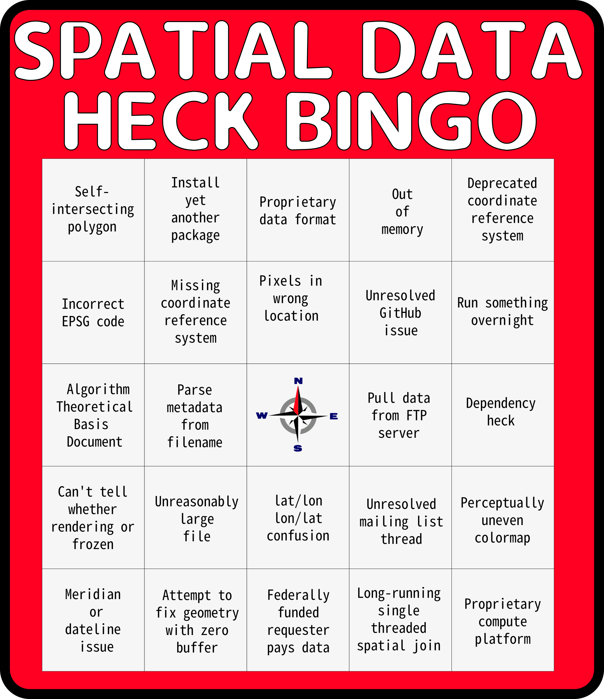

It's 2022. 
Working with spatial data is easier now than ever before. 
Between the rise of cloud native geospatial, SpatioTemporal Asset Catalogs, and the maturation of open source spatial libraries, it is extremely rare to find oneself in spatial data hell. 

And yet, there are many small annoying things that slow the day to day work. 
This is spatial data heck. 

And this is the spatial data heck bingo card. 
Put it on your wall and know that you're not alone. 

